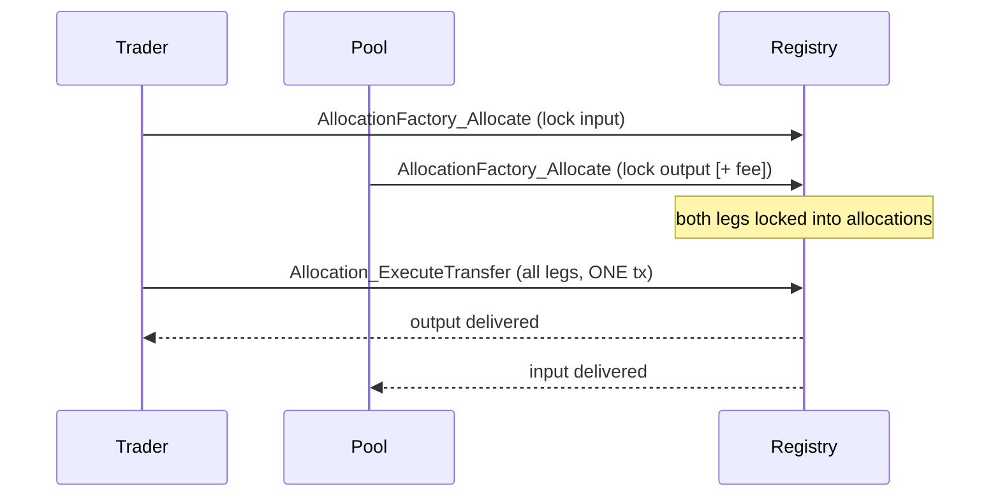

Every OneSwap v2 swap is an **atomic Delivery-versus-Payment (DvP)**: the trader's
input and the pool's output settle in a **single** on-ledger transaction. Either
all legs commit, or none do. v2 has **no orchestrated / multi-transfer path** — the
only way funds move is one atomic transaction.

## Why it matters

A multi-step "saga" swap (send input, then send output) has a window where one leg
has landed and the other hasn't — requiring refunds, recovery, and trust. Atomic
DvP removes that window entirely:

- **No partial states.** The trader can never lose their input without receiving
  the output.
- **No custody window.** The trader's funds are only ever locked into an
  allocation that either executes or is released back.
- **Contract-controlled.** The registry's own `Allocation_ExecuteTransfer` choice
  enforces the exchange; OneSwap can't move funds any other way.

## The mechanism (CIP-56 allocations)



1. Each leg's sender locks its funds into an **Allocation** for the settlement.
2. The settlement executor exercises `Allocation_ExecuteTransfer` on **all**
   allocations in **one** transaction → atomic.
3. If anything fails, `Allocation_Withdraw` releases the locked funds back to their
   owners — a clean, automatic refund.

## What the SDK guarantees

- `swap()` and `interactive.swap()` only ever return after an atomic settlement.
- The result carries `atomic: true` and the Canton `updateId`.
- On failure, the allocations are withdrawn server-side and the call throws — the
  trader's balance is exactly as it was before.

## Idempotency

Every fund-moving call accepts an `idempotencyKey`. A retry with the same key
returns the original result instead of executing twice — safe against network
timeouts and lost responses.

```ts
await dex.swap(1.0, true, { idempotencyKey: 'order-42' });
// a repeat with 'order-42' returns the same result, never double-swaps
```
