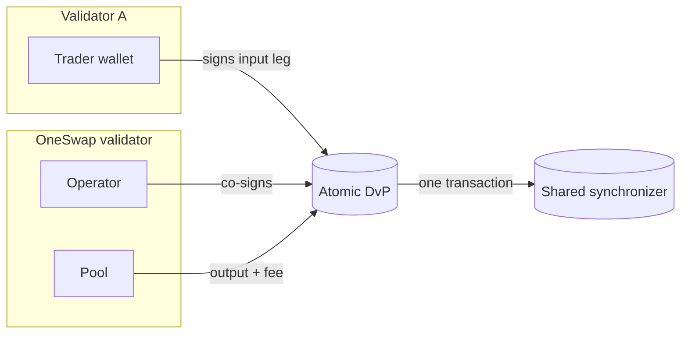

On Canton, parties are hosted on validators (participants). A user's wallet party
may live on a **different** validator than OneSwap's. v2 supports these
**cross-validator** swaps natively — the CIP-56 allocation DvP is
participant-agnostic.

## The key idea

The atomic DvP settlement only needs each leg's **sender to authorize** their leg.
It does **not** require any single participant to host every party. So:

- The **trader** (on validator A) authorizes their input leg by signing.
- The **operator / pool** (on OneSwap's validator B) authorizes the output + fee
  legs.
- The settlement executes atomically across the synchronizer both parties share.

No party needs to be re-hosted, and the trader never gives up custody.

## What an integrating wallet must provide

1. A Canton **party** with CIP-56 token holdings (on any validator that shares a
   synchronizer with OneSwap).
2. The party's **public key fingerprint**.
3. A way to **sign a transaction hash** with the party's key (Ed25519).

That's the entire `WalletSigner` interface. See
[Interactive swaps](/guides/interactive-swaps) for the integration.

## Requirements & notes

- The trader's party and OneSwap's pool must be reachable on a **common
  synchronizer** (domain) so the DvP can commit there.
- The tokens must be **CIP-56 token-standard** instruments whose registry supports
  allocations (all OneSwap-listed tokens do).
- The operator co-signs server-side (configured via its external key), so the
  integrating wallet only ever signs **its own** leg.

<Note>
Custody stays with the user throughout. Their funds are only locked into an
allocation that either executes the swap or is released back to them.
</Note>
