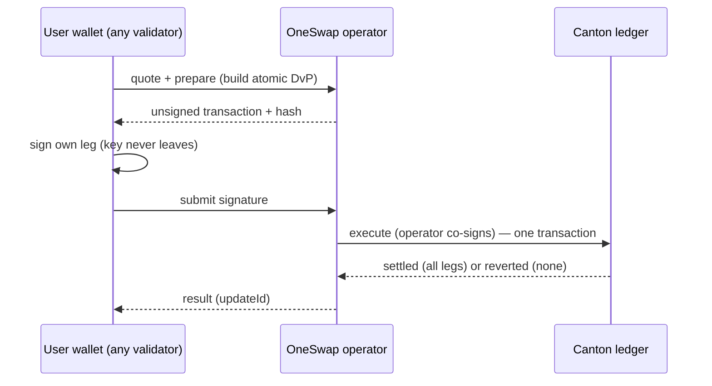

OneSwap v2 is an AMM DEX on the **Canton Network** built on the CIP-56 token
standard. Every swap settles as an **atomic Delivery-versus-Payment (DvP)**
transaction: both legs move in a single, contract-controlled, all-or-nothing
on-ledger transaction. There is no orchestrated / multi-transfer path — funds
either swap in one transaction, or nothing moves.

## What's new in v2

<CardGroup cols={2}>
  <Card title="Atomic DvP only" icon="link">
    Input and output settle in one token-standard allocation transaction. No
    intermediate custody window, no partial states, no saga to unwind.
  </Card>
  <Card title="Self-custody swaps" icon="key">
    Users keep their own key on **any** validator. They sign their own leg; the
    operator co-signs; the ledger settles atomically. No deposit required.
  </Card>
  <Card title="Cross-validator" icon="network-wired">
    A wallet hosted on a different validator can trade against OneSwap pools
    directly — the token standard makes the DvP participant-agnostic.
  </Card>
  <Card title="One SDK, two modes" icon="cube">
    `oneswap-v2-sdk` covers both the custodial flow (embed in minutes) and the
    interactive self-custody flow (integrate any wallet).
  </Card>
</CardGroup>

## Two ways to trade

| | Custodial | Interactive (self-custody) |
|---|---|---|
| Who holds the key | OneSwap (platform wallet) | The user's own wallet |
| Where the party lives | OneSwap's validator | **Any** validator |
| Signing | Backend signs for the user | User signs their leg; operator co-signs |
| Best for | Embedded apps, quick onboarding | Wallets integrating OneSwap; power users |
| Settlement | Atomic DvP | Atomic DvP |

Both paths produce the **same** on-ledger result: one atomic DvP transaction.

## How a swap settles

<Note>
Nothing moves until `execute`. When it runs, the trader's input, the pool's
output, and the network fee all settle in **one** transaction — or the whole
thing reverts and the trader's allocation is released.
</Note>

## Next steps

<CardGroup cols={2}>
  <Card title="Quickstart" icon="rocket" href="/quickstart">
    Install the SDK and do your first swap in both modes.
  </Card>
  <Card title="Interactive swaps" icon="key" href="/guides/interactive-swaps">
    Integrate a self-custody wallet on any validator.
  </Card>
  <Card title="Atomic DvP" icon="link" href="/concepts/atomic-dvp">
    How the all-or-nothing settlement works.
  </Card>
  <Card title="SDK reference" icon="book" href="/reference/sdk-methods">
    Every method, typed.
  </Card>
</CardGroup>
